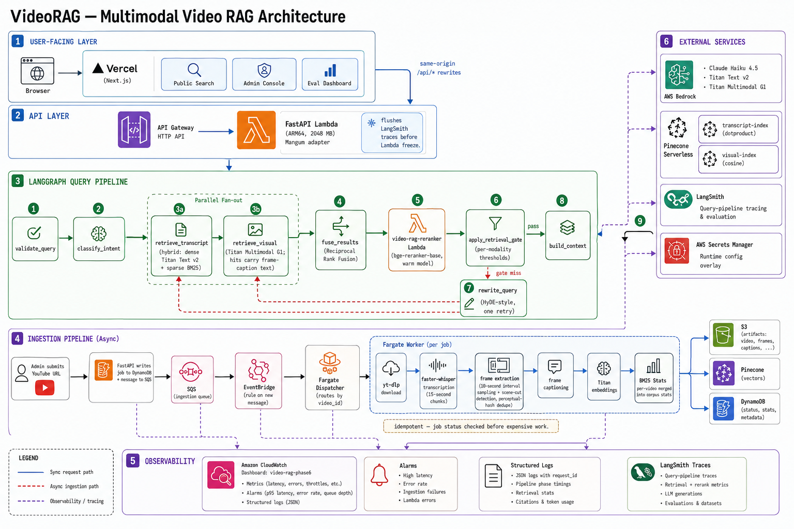

# Multimodal Video RAG

VideoRAG is a deployed search app for long-form video. Ask a question, and it returns the transcript chunks or visual frames that support the answer, with timestamps back to the source moment.

The frontend runs on Vercel, and the backend is AWS-native: FastAPI in a Lambda container, SQS/Fargate ingestion, S3 artifacts, Pinecone indexes, LangGraph retrieval, and Bedrock Claude Haiku for answer generation and query rewrite. If retrieval is weak, the app refuses instead of guessing.

## How it works

1. Admin submits a YouTube URL through the web console.
2. A Fargate worker downloads the video, extracts keyframes every 10 seconds, splits the transcript into 15-second chunks with faster-whisper, and embeds both modalities into separate Pinecone indexes.
3. When a user asks a question, a LangGraph pipeline classifies intent, retrieves from both indexes, fuses results with Reciprocal Rank Fusion, reranks, gates on evidence strength, and generates a grounded answer via Bedrock.
4. The response includes the answer, confidence score, and clickable timestamped citations.

Transcript questions and visual questions follow different retrieval paths. For example, "what did she say about planning?" leans on transcript chunks, while "show me the whiteboard" leans on frame search.

## Architecture



The web app calls the API through same-origin rewrites. Search requests run through FastAPI and a 9-node LangGraph pipeline. Ingestion runs asynchronously through DynamoDB, SQS, EventBridge, and Fargate. Transcript vectors and visual vectors stay in separate Pinecone indexes because they use different models and scoring behavior. S3 keeps the derived artifacts, LangSmith traces the query pipeline, and CloudWatch tracks operational health.

Runtime note: the API Lambda is sized at 2048 MB to leave headroom for controlled CPU cross-encoder runs.

Infrastructure is CDK in Python, with least-privilege IAM, Secrets Manager runtime config, VPC endpoints where they matter, and alarms for the paths that should wake someone up.

## Eval results

Real evaluation over 13 indexed videos, 135 hand-labeled queries (transcript, visual, timestamp, hybrid, summary, no-answer). Deterministic retrieval metrics plus Haiku LLM judge on answerable queries.

| Config | MRR | Timestamp@5s | No-answer F1 |
|---|---:|---:|---:|
| Dense only | 0.827 | 0.766 | 0.714 |
| Dense + strict gate | 0.667 | 0.605 | 0.343 |
| Hybrid BM25 | 0.707 | 0.605 | 0.000 |
| Hybrid + rerank | 0.742 | 0.637 | 0.000 |
| Hybrid + rewrite | 0.707 | 0.605 | 0.000 |
| **Production (hybrid + rerank + rewrite + answer gen)** | **0.795** | **0.734** | **0.714** |

LLM judge on 117 answerable queries: quality 0.836, grounded 0.923, correct 0.803, useful 0.940.

MRR and Timestamp@5s are the metrics that discriminate between retrieval configs — Recall@5 is near-ceiling. Weak-evidence refusal is owned by the LLM's structured `grounded` flag during answer generation, so retrieval-only configs sit at No-answer F1 0.000 and the production config carries it to 0.714 (every refusal is attributable via a per-query `refusal_reason`). The single largest quality lever was attaching frame-caption text to image-embedding hits: before that, a retrieved frame surfaced as a contentless "Visual frame at 10:05" snippet the answer model could not ground on.

## Interesting engineering decisions

**Two Pinecone indexes, not one.** Transcript uses dotproduct (since Titan Text v2 embeddings are normalized, dotproduct = cosine but faster). Visual uses cosine because Titan Multimodal G1 embeddings aren't consistently normalized. Mixing them in one index would require a single similarity metric that works poorly for one modality.

**Per-modality retrieval gates.** A transcript score of 0.3 means something different from a visual score of 0.3 (different embedding models, different metrics). The refusal gate checks each modality against its own threshold. This fixed a class of bugs where near-tied scores caused the wrong modality to win.

**BM25 sparse vectors alongside dense.** The hybrid path alpha-blends dense Titan vectors with sparse BM25 term frequencies on the same Pinecone query. This helps with exact-match queries ("what does she say about proper planning?") where dense embeddings alone rank a semantically-similar but wrong chunk higher.

**Query rewrite is on-miss, not always-on.** The raw query retrieves first (transcript and visual fan out in parallel inside the LangGraph superstep); only a retrieval-gate refusal triggers one HyDE-style rewritten retry. Queries that succeed raw — the common case — never pay the rewrite LLM call, so the rewrite's latency and cost apply exactly where they can help.

**Idempotent ingestion.** SQS delivers at-least-once. The worker checks job status in DynamoDB before doing any expensive work (downloads, transcription, embedding). A redelivered message for a completed job gets a log line and a delete, not a duplicate $2 Bedrock bill.

**Cross-encoder reranking runs in its own Lambda.** `BAAI/bge-reranker-base` (~500MB) can't load inside the API request path — API Gateway HTTP has a fixed 30-second integration timeout, and cold-start model loading would blow it. So the API calls a dedicated `video-rag-reranker` Lambda (warm model, invoked per query) instead of baking inference into the request. On the current golden set rerank moves hybrid MRR from 0.707 to 0.742.

## Current limits

- MRR drops ~3 points from dense-only to production (0.827 → 0.795) because the hybrid path trades a little semantic ranking for exact-match wins and refusal accuracy.
- Remaining no-answer over-refusals are retrieval/caption-bound (the labeled evidence doesn't reach the answer context), not prompt-bound — the next lever is frame caption coverage, not grounding criteria.
- Admin ingestion is password-gated, not a multi-user product flow.

## Run locally

You need [uv](https://docs.astral.sh/uv/) and [pnpm](https://pnpm.io/). Copy `.env.example` to `.env` and fill in your keys.

```bash
uv sync --all-packages
uv run uvicorn api.main:app --reload        # API at localhost:8000

pnpm install
pnpm --filter web dev                       # Frontend at localhost:3000
```

For local admin login, generate `ADMIN_PASSWORD_HASH` and `SESSION_SECRET` with:

```bash
uv run --with argon2-cffi python scripts/init_secrets.py
```

The frontend proxies `/api/*` to the backend via Next.js rewrites, so the browser talks to one origin in local and production.

```bash
uv run pytest -q                            # 124 tests
uvx ruff check . && uvx ruff format --check .
pnpm --filter web lint && pnpm --filter web build
```

## Tech

- **LLM:** AWS Bedrock, Claude Haiku 4.5 (answer generation + query rewrite)
- **Embeddings:** Titan Text Embedding v2 (transcript), Titan Multimodal G1 (visual frames)
- **Transcription:** faster-whisper in the ingestion worker
- **Reranking:** bge-reranker-base (cross-encoder, CPU inference in Lambda)
- **Vector DB:** Pinecone serverless (2 indexes: transcript dotproduct, visual cosine)
- **Orchestration:** LangGraph (stateful query pipeline with 9 nodes)
- **Backend:** FastAPI, Pydantic, deployed as ARM64 Lambda container
- **Frontend:** Next.js, TypeScript, Tailwind, shadcn/ui
- **Infra:** CDK (Python), S3, SQS, ECS Fargate, DynamoDB, API Gateway, CloudWatch
- **Eval:** Custom deterministic harness (Recall@K, MRR, Timestamp@Ns, modality accuracy, no-answer F1) + Haiku LLM judge
- **Observability:** LangSmith tracing, CloudWatch dashboard + alarms, structured logging

## Live

- Web: https://multimodal-video-rag-web.vercel.app
- API: https://fsd8xleob9.execute-api.us-east-1.amazonaws.com/

## License

MIT
